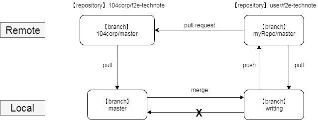

# Git 協作說明

這篇是說明參與協作時，建議的git工作流程

(其實是自己會搞混，為了以後省時間留紀錄....Orz)

## 工作流程示意圖



## Clone專案與設定

這邊以上圖做例子解說

1. fork本專案 (104corp/f2e-technote) 到自己的遠端

2. 到自己的遠端repo，clone專案 (user/f2e-technote) 到本機端
```bash
git clone git@github.com:user/f2e-technote.git
```

3. 分成兩個branch：master用來接收 (104corp/f2e-technote) 的更新、writing用來編輯和合併master更新
```bash
git branch -m master writing    // 將master改名為writing
git checkout -b master          // 新建並移動到master分支
```

4. 加入遠端repo，並改名為自己習慣的簡稱
```bash
git remote rename origin myRepo
git remote add 104corp git@github.com:104corp/f2e-technote.git
```

5. 設定每個本地branch追蹤的remote branch
```bash
git fetch 104corp  // 將遠端資料拉回來以便設定

git branch -u 104corp/master master
git branch -u myRepo/master writing
```

6. 取消master的push功能，防止手殘 Orz
```bash
git remote set-url --push 104corp no-push    // 將push的url改成字串，使push會失敗
```

7. 修改 git config 讓push時即使本機端branch name和遠端不同，也可以push到指定的遠端branch
```bash
git config push.default upstream    // 預設為matching，找到相同名稱branch才push
```

8. 完成了! 可以使用以下指令檢查~
```bash
git config -l                 // 列出所有config
git remote -v                 // 列出所有遠端庫
git remote show <branchname>  // 顯示該遠端branch詳細資料，包含push、pull對應的本地branch
```

## 工作流程

* 每次完成編輯commit前，先做一次更新再commit

1. 暫存目前的所有變更
```bash
[writing] git add .
[writing] git stash
```

2. 從 104corp/f2e-technote 拉更新到本機
```bash
[writing] git checkout master
[master] git pull
```

3. 合併master到writing分支
```bash
[master] git checkout writing
[writing] git merge master      // fast-forward
```

4. 將暫存的變更載回來，並commit
```bash
[writing] git stash list       // 查看所有暫存的清單
[writing] git stash apply 0    // 通常最新的都在最上面，index為0
[writing] git add .
[writing] git commit
```

5. push到自己的遠端repo，開啟github頁發送pull request
```bash
[writing] git push
```